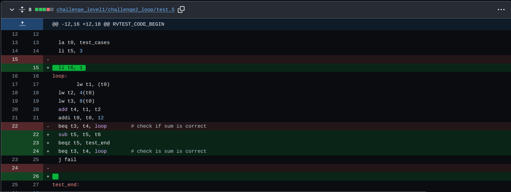

##Bug explanation: 
Issue was test not exiting out of loop because it keeps looping and there is no code added to exit out of the loop.

##Explanation of the fix:
Added a decrementing counter initialized to 3, decrement on each iteration and break out of the loop if the counter reaches zero. Counter initialized to 3 since there are 3 testcases.

##Bug fix screenshot
