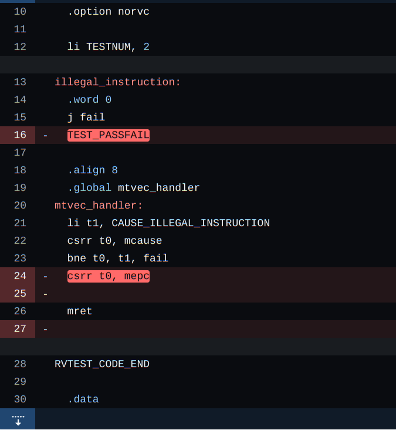
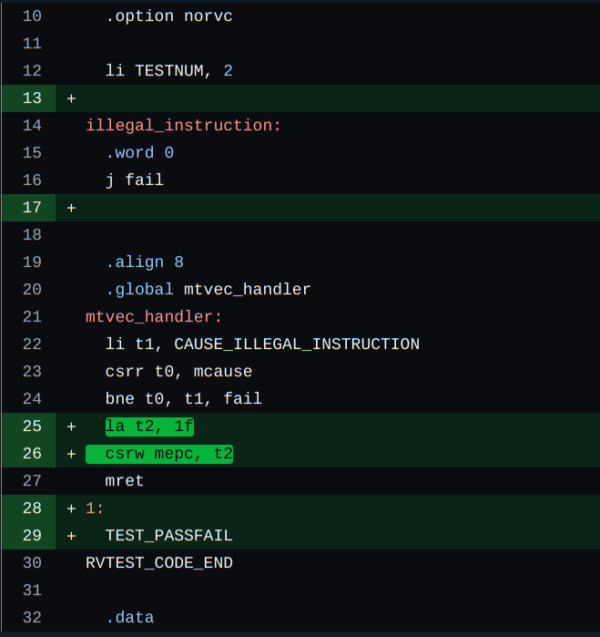

## Bug explanation with screenshot: 
Exception handler jumps back to illegal instruction which again raises exception creating a never ending loop. 

## Screenshot of the fix:

## Explanation of the fix:
In the exception handler, jump to a routine that ends the program .