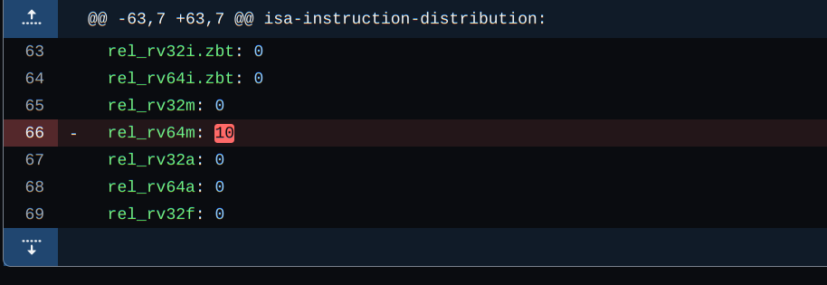
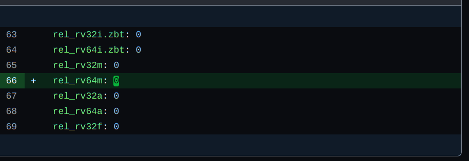

## Bug explanation with screenshot:
rel_rv64m is not 0 in the rv32i.yml file and hence it is causing error because 64-bit instructions are not allowed in 32-bit tests.

## Screenshot of the fix:

## Explanation of the fix: 
Sets rel_rv64m to 0 in the rv32i.yml file because it is 32-bit testing and hence distributions of all 64-bit instructions to be set to zero.
