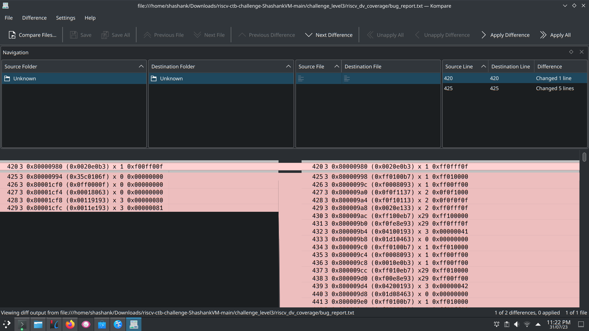

## Bug hunting methodology
1. Use random testing to catch bugs not thought of. Directed tests to catch corner case bugs.
2. Verify the bugs are valid using directed test.
3. Copy directed assembly test to coverage folder, generate spike log, convert log to CSV and generate coverage report.
4. If coverage satisfactory, end. Else go back to step 1.

## Test fails:
1. Or instruction is failing incorrect answer
2. Or immediate instruction is failing incorrect answer

## Failing screenshots
